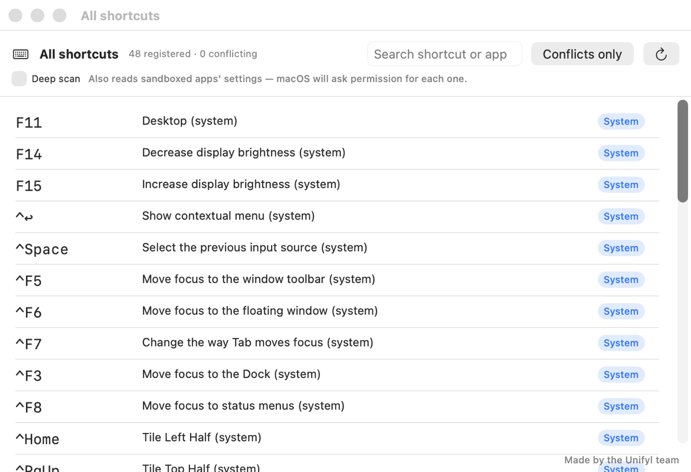

<h1 align="center">HotkeyDetective</h1>

<p align="center">
  <strong>Find out which app stole your keyboard shortcut.</strong><br>
  macOS gives you no way to ask. This does.
</p>

<p align="center">
  
  
  
</p>

<p align="center">
  <strong>Language:</strong>
  <strong>English</strong> ·
  <a href="docs/readme/README.ko.md">한국어</a> ·
  <a href="docs/readme/README.ja.md">日本語</a> ·
  <a href="docs/readme/README.zh-Hans.md">简体中文</a> ·
  <a href="docs/readme/README.zh-Hant.md">繁體中文</a> ·
  <a href="docs/readme/README.de.md">Deutsch</a> ·
  <a href="docs/readme/README.fr.md">Français</a> ·
  <a href="docs/readme/README.es.md">Español</a> ·
  <a href="docs/readme/README.it.md">Italiano</a> ·
  <a href="docs/readme/README.pt-BR.md">Português</a> ·
  <a href="docs/readme/README.ru.md">Русский</a> ·
  <a href="docs/readme/README.ar.md">العربية</a> ·
  <a href="docs/readme/README.th.md">ไทย</a> ·
  <a href="docs/readme/README.tr.md">Türkçe</a> ·
  <a href="docs/readme/README.vi.md">Tiếng Việt</a>
</p>

---

You press ⇧⌘4 and nothing happens. Some app took it — but which one? macOS ships
no API that answers this, and no way to ask in System Settings either.

HotkeyDetective answers it by gathering evidence and showing you the reasoning:

<p align="center">
  
</p>

## How it works

There is no single source of truth for "who owns this shortcut," so the app
collects independent signals and weighs them:

| Source | What it proves | Strength |
| --- | --- | --- |
| **System shortcuts** | macOS's own table says this combination is bound | Certain |
| **App config** | A known app's settings file binds this combination | High (Low when the app isn't running) |
| **Config scan** | An app's settings match a known shortcut-storage format | Medium |
| **Reaction** | An app opened a window or came to the front right after the keypress | High |
| **Hotkey probe** | Some process holds a Carbon hotkey registration | Observation only |

A verdict is `confirmed`, `likely`, `contested`, `occupied but unidentified`,
or `free`. Every claim shows the evidence it rests on, so you can judge it
yourself rather than trusting a black box.

One distinction matters: a **reaction** proves an app *received* the key, not
that it *registered* it — a reaction can corroborate an owner but never
contest one. Without that rule, ⌘Space reads as "the system and Spotlight are
fighting" when nothing is wrong.

## Install

Requires macOS 14 or later.

**Homebrew** (recommended — `brew upgrade` keeps it current):

```bash
brew install --cask goodbug89/tap/hotkey-detective
```

**Direct download:** get the notarized `.dmg` from the [latest release](https://github.com/goodbug89/hotkey-detective/releases/latest), open it, and drag the app to Applications.

**From source:**

```bash
git clone https://github.com/goodbug89/hotkey-detective.git
cd hotkey-detective
Scripts/bundle.sh
open build/HotkeyDetective.app
```

The build signs with a Developer ID certificate if your keychain has one, and
falls back to ad-hoc signing otherwise. Ad-hoc builds lose their permission
grants on every rebuild — see [BUILDING.md](BUILDING.md).

## Permissions

The probe needs both **Accessibility** and **Input Monitoring**. macOS requires
both for a listen-only keyboard event tap.

Key presses are observed and never intercepted, logged, or stored. The tap is
created with `.listenOnly` so the real owner still receives the key — that is
exactly how reaction detection works. The only key data that survives a probe
is the single combination you chose to look up. There is no network code in
this repository.

Without permissions the app still runs in **limited mode**: pick a combination
manually and it answers from settings files alone.

## Inventory

Beyond one-shot probing, the app lists every shortcut it can see — system
bindings, known apps, and scan results — with conflicts pinned to the top.

<p align="center">
  
</p>

**Deep scan** additionally reads sandboxed apps' settings. macOS asks for
permission per app, so it is off by default.

## Known limits

Being honest about what this cannot do:

- **Carbon hotkey probing cannot see other processes.** `RegisterEventHotKey`
  reports a conflict only within your own process, so the "occupied but
  unidentified" verdict is effectively unreachable. An app that registers a
  hotkey, shows no window, and stores its config in an unrecognized format
  stays invisible.
- **System feature names are English outside Korean.** macOS keeps its own
  translations in a place we cannot read, and inventing our own would disagree
  with what you see in System Settings.
- **Config scanning recognizes two storage formats** (the `KeyboardShortcuts`
  library and `MASShortcut`-style dictionaries). Apps with custom formats need a
  dedicated parser — [contributions welcome](CONTRIBUTING.md).

## Development

```bash
swift test          # 94 tests
Scripts/bundle.sh   # build/HotkeyDetective.app
```

The design documents in [`docs/superpowers/`](docs/superpowers/) record how this
was built, including the measurements that overturned several assumptions along
the way — the hand-maintained shortcut table that turned out to be wrong in four
places, and a fn-key behavior that only a device test could settle.

## Who makes this

HotkeyDetective is built by the team behind
**[Unifyl](https://unifyl.app)**, a dual-pane file manager for macOS.

## License

MIT — see [LICENSE](LICENSE).
