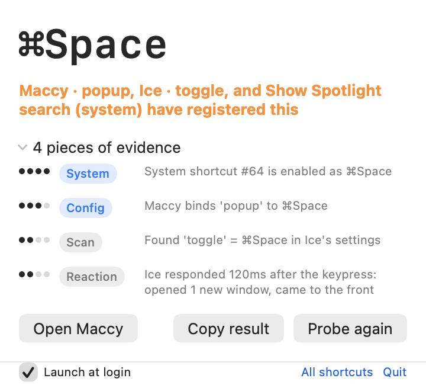

<h1 align="center">HotkeyDetective</h1>

<p align="center">
  <strong>ショートカットを奪ったアプリを特定します。</strong><br>
  macOS には尋ねる手段がありません。これがあります。
</p>

<p align="center">
  
  
  
</p>

<p align="center">
  <strong>言語:</strong>
  <a href="../../README.md">English</a> ·
  <a href="README.ko.md">한국어</a> ·
  <strong>日本語</strong> ·
  <a href="README.zh-Hans.md">简体中文</a> ·
  <a href="README.zh-Hant.md">繁體中文</a> ·
  <a href="README.de.md">Deutsch</a> ·
  <a href="README.fr.md">Français</a> ·
  <a href="README.es.md">Español</a> ·
  <a href="README.it.md">Italiano</a> ·
  <a href="README.pt-BR.md">Português</a> ·
  <a href="README.ru.md">Русский</a> ·
  <a href="README.ar.md">العربية</a> ·
  <a href="README.th.md">ไทย</a> ·
  <a href="README.tr.md">Türkçe</a> ·
  <a href="README.vi.md">Tiếng Việt</a>
</p>

---

⇧⌘4 を押しても何も起きない。どれかのアプリが奪っている — でもどれ？ macOS にはこれを答える API がなく、システム設定でも確認できません。

HotkeyDetective は根拠を集めて判定し、その理由も一緒に示します:

<p align="center">
  
</p>

## 仕組み

「誰がこのショートカットを所有しているか」に唯一の正解はないため、独立した複数の手がかりを集めて重み付けします:

| 出処 | 示すこと | 強さ |
| --- | --- | --- |
| **システムショートカット** | macOS 自身の表がこの組み合わせを割り当てている | 確定 |
| **アプリ設定** | 既知アプリの設定ファイルがこの組み合わせを割り当てている | 高（未起動なら低） |
| **設定スキャン** | アプリ設定が既知の保存形式と一致する | 中 |
| **反応検知** | キー入力直後にアプリがウインドウを開くか最前面に来た | 高 |
| **ホットキー登録試行** | 別のプロセスが Carbon ホットキーを保持している | 観測のみ |

判定は `確定` · `推定` · `競合` · `占有（特定不能）` · `未使用` のいずれかです。すべての主張に根拠が付くので、ブラックボックスを信じる代わりに自分で判断できます。

一点重要な区別があります: **反応**はアプリがキーを*受け取った*証拠であって、*登録した*証拠ではありません。反応は所有者を裏付けることはできても、否定することはできません。この規則がないと ⌘Space が「システムと Spotlight が争っている」と誤表示されます。

## インストール

macOS 14 以降が必要です。

**Homebrew**（推奨 — `brew upgrade` で最新に保てます）:

```bash
brew install --cask goodbug89/tap/hotkey-detective
```

**直接ダウンロード:** [最新リリース](https://github.com/goodbug89/hotkey-detective/releases/latest) から公証済みの `.dmg` を取得し、開いてアプリを「アプリケーション」にドラッグします。

**ソースからビルド:**

```bash
git clone https://github.com/goodbug89/hotkey-detective.git
cd hotkey-detective
Scripts/bundle.sh
open build/HotkeyDetective.app
```

キーチェーンに Developer ID 証明書があればそれで署名し、なければ ad-hoc 署名になります。ad-hoc ビルドは再ビルドのたびに権限が失われます — [BUILDING.md](../../BUILDING.md) を参照。

## 権限

プローブには**アクセシビリティ**と**入力監視**の両方が必要です。listen-only のキーボードイベントタップに macOS が両方を要求します。

キー入力は観察するだけで、横取り・記録・保存は一切しません。タップは `.listenOnly` で作られるため、本来の所有者がキーをそのまま受け取ります — 反応検知が機能する原理がこれです。プローブ後に残るキーデータは、あなたが調べた組み合わせ 1 つだけです。このリポジトリにネットワークコードはありません。

権限がなくても**制限モード**で動作します。組み合わせを手動で選び、設定ファイルだけで判定します。

## 既知の制限

- **Carbon ホットキーのプローブは他プロセスを見られません。** `RegisterEventHotKey` は自プロセス内でしか衝突を報告しないため、「占有（特定不能）」の判定は実質到達不可能です。ホットキーを登録し、ウインドウを出さず、設定を未知の形式で保存するアプリは見えません。
- **システム機能名は韓国語以外では英語です。** macOS は自前の翻訳を読み取れない場所に置いており、独自に訳すとシステム設定の表記と食い違います。
- **設定スキャンは 2 つの保存形式のみ認識します**（`KeyboardShortcuts` ライブラリと `MASShortcut` 系）。独自形式のアプリには専用パーサーが必要です — [貢献歓迎](../../CONTRIBUTING.md)。

## 開発

HotkeyDetective は macOS 向けデュアルペインファイルマネージャ **[Unifyl](https://unifyl.app)** を作るチームが開発しています。

## ライセンス

MIT — [LICENSE](../../LICENSE)

